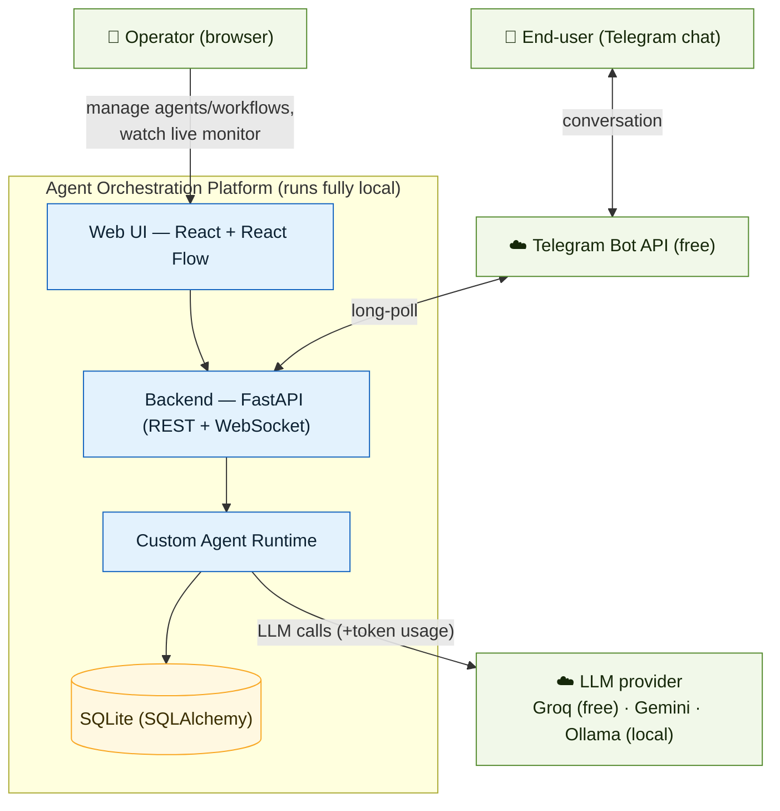
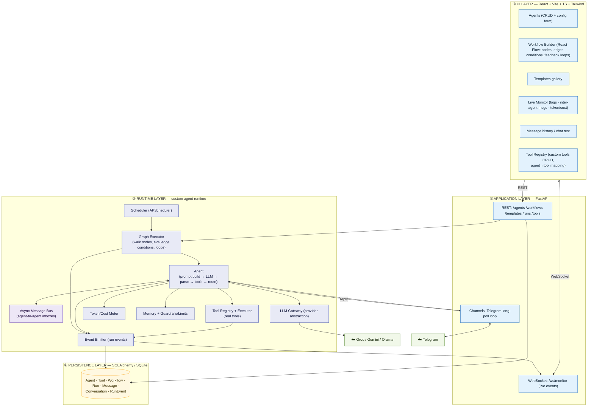
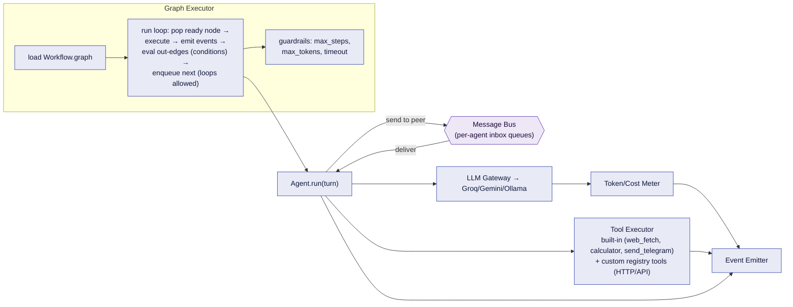
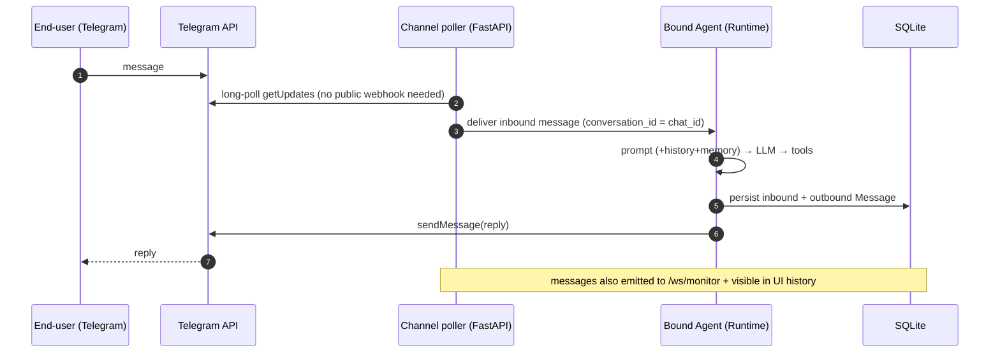
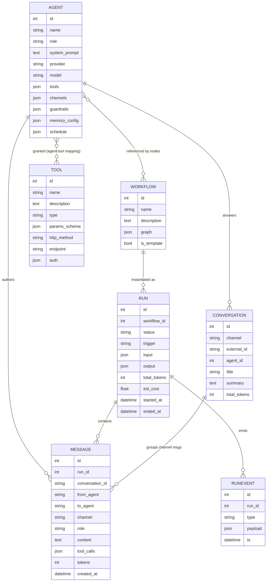

# Agent Orchestration Platform — High-Level Design (HLD)

> **Status:** ✅ **Built.** This was the original system design; the platform is now fully implemented (FastAPI + custom runtime + React 19; **154 tests** passing). The design held up well — the **Post-design additions** below list the capabilities that evolved on top of it.
>
> **Build philosophy:** a *production-minded prototype* — genuinely working end-to-end, clean layered architecture, tests on critical paths, **one-command local**; production hardening (auth, real broker, scaling) is deliberately out of scope but documented as "next steps."
>
> Diagrams are Mermaid (render in VS Code preview). Palette: `svc` service/component · `data` store · `bus` async channel · `ext` external.
>
> **Post-design additions (built, evolved from this design):** multi-tenant SaaS (row-level isolation) · **conversational per-turn routing** + a split-screen **chat cockpit** · **OpenAPI/Swagger tool-import** (incl. importing from a live external API) · a tenant-aware **Dashboard analytics** view · a full **template lifecycle** (create / *Save as template* / delete in the UI, idempotent) · a stateless **draft agent-tester** (test an unsaved config) · **3** seed templates (not 2) and a single **Supervisor** with fallback-to-self (the original Triage/Escalation pair was superseded).

---

## 1. Requirement → Component traceability

Every core requirement is owned by a component (so nothing is missed):

| Requirement | Owned by |
|---|---|
| Agent CRUD (name, role, prompt, model, tools, channels) | API `agents` router + `Agent` model + Agents UI |
| Agent config (schedules, memory, skills, interaction rules, guardrails, limits) | `Agent` model + Runtime (memory, guardrails, scheduler) |
| Visual workflow builder (conditions + feedback loops) | Frontend **React Flow** + `Workflow.graph` (JSON) |
| ≥2 pre-built workflow templates | `Workflow.is_template` seed data |
| Real runtime executes real tools | **Custom Runtime** (Graph Executor + Tool Executor) |
| **Custom user-defined tools** + agent↔tool mapping (like the tool-registry module) | **Tool Registry** (API `/tools` + `Tool` model + Tools UI), Tool Executor |
| Agents communicate asynchronously (agent-to-agent) | **Async Message Bus** |
| ≥1 agent on a messaging channel (human chat) | **Channel layer** (Telegram adapter) |
| Web UI to manage everything | Frontend (React) |
| Message history persisted + visible in UI | `Message` store + Monitoring/History UI |
| Live monitoring (logs, inter-agent msgs, token/cost) | **Event Emitter** → WebSocket → Monitoring UI |
| End-to-end demo, 2+ agents, real task | Templates + Runtime + Telegram |
| Single setup command, fully local | docker-compose / `make dev`, SQLite |
| Tests for critical paths | pytest: agent create / workflow run / msg delivery |

---

## 2. System Context (C4 level 1)



Two human actors: the **operator** (builds/monitors via the web UI) and the **end-user** (talks to an agent over Telegram). One LLM provider (free), one channel (free).

---

## 3. Component Architecture (the 3 layers)



**Clean separation:** UI talks only to the API; the API delegates execution to the Runtime; the Runtime is the only thing that talks to LLMs/tools/bus; persistence is behind SQLAlchemy. The **Event Emitter** is the spine of live monitoring — every node start, agent message, tool call, and token count is emitted to both the WebSocket (live) and the DB (history).

---

## 4. Custom Runtime — internal design (the heart)

The "custom runtime" = a **lean graph executor + async message bus**. A workflow is a directed graph (possibly cyclic, for feedback loops). Node types:

| Node | Does |
|---|---|
| **Start** | entry; injects the trigger input |
| **Agent** | runs one agent turn (prompt → LLM → parse → tools → output) |
| **Tool** | a standalone tool call (optional; tools can also be called inside an Agent) |
| **Router/Condition** | evaluates a condition on state → picks the next edge |
| **End** | terminates the run |

Edges carry an optional **condition** (predicate over run state / last output) and can point **backwards** (feedback loop). The executor is **async**; independent branches run concurrently; agents exchange messages via the **bus** (each agent has an inbox), which is what makes communication *asynchronous* and *agent-to-agent*.



**Agent turn** = build prompt (system + role + memory + inbox messages + input) → LLM call (via Gateway, metered) → parse structured output `{response, tool_calls?, route?}` → execute any tool calls → optionally send messages to peer agents (bus) → return output + routing hint. Guardrails cap steps/tokens to prevent runaway loops.

### 4.1 Tool system — registry + custom tools (mirrors the tool-registry module)

Tools are **first-class configurable records, not hardcoded**. A **Tool** has: `name`, `description`, a JSON **parameter schema** (what the LLM must supply), and a **type**:
- **`builtin`** — a registered Python function (seeded: `web_fetch`, `calculator`, `send_telegram`).
- **`http`** — a **user-defined REST call**: method, URL template, headers/auth, body/param mapping (define it in the UI, no code).

Agents are granted tools via an **agent↔tool mapping** (`Agent.tools`), exactly like the platform's *define-tool → map-to-assistant → runtime-executes* pattern. At runtime the Agent advertises **only its mapped tools** to the LLM as function specs; when the LLM emits a tool call, the **Tool Executor** runs it (builtin → call the function; http → perform the request with the supplied args), and feeds the result back into the turn. Kept lean for the prototype (direct execution; no AI-generated code), but the registry + mapping makes the tool set fully configurable — boosting the "configurable dimensions per agent" metric and giving a clean "how to add a tool" story.

---

## 5. Key runtime flows

### 5.1 Build → run a multi-agent workflow

```mermaid
sequenceDiagram
    autonumber
    participant UI as Web UI (React Flow)
    participant API as FastAPI
    participant EX as Graph Executor
    participant AG as Agents
    participant BUS as Message Bus
    participant WS as WebSocket (Monitor)
    UI->>API: POST /workflows (graph) ; POST /runs {workflow_id, input}
    API->>EX: start run
    loop until End / guardrail
        EX->>AG: execute current Agent node
        AG->>AG: prompt → LLM (metered) → tools
        AG-->>BUS: message to peer agent (async)
        BUS-->>AG: deliver to peer inbox
        AG-->>EX: output + route
        EX->>EX: eval edge conditions → next node (loop ok)
        EX-->>WS: emit events (node, msg, tool, tokens)
        EX-->>API: persist Message + RunEvent
    end
    EX-->>UI: run complete (status, output, totals)
```

### 5.2 Live human conversation via Telegram



### 5.3 Scheduled trigger
APScheduler fires a workflow/agent on a cron/interval → same Graph Executor path as 5.1, with `trigger = "schedule"`.

---

## 6. Workflow graph model + the 3 templates

`Workflow.graph` (JSON): `{ nodes: [{id, type, ref(agent_id/tool), config}], edges: [{from, to, condition?}] }`. React Flow edits it; the executor runs it. Conditions are simple, safe expressions over run state (e.g. `last.intent == "billing"`, `attempts < 3`).

**Template 1 — "Research → Report → Notify"** (linear + feedback loop):
Start → **Researcher** (web_fetch tool) → **Writer** (summarize); Writer→Researcher feedback edge if `needs_more_info`; → **Notifier** (send_telegram) → End. *(2+ agents executing a real task ✓)*

**Template 2 — "Support Router"** (supervisor routing + bounded loop):
Start → **Supervisor** (router) → one of **Billing / Tech / Sales** (chosen via the `handoff` tool); an unresolved case loops **back to the Supervisor** to re-route (bounded by `max_visits`) → End. *(The original "Triage → … → Escalation" sketch was superseded by a single **Supervisor** that owns the fallback — simpler, and routing emerges from wiring the Supervisor to ≥2 specialists, who are injected into its prompt with their roles at runtime.)*

**Template 3 — "Collaborative Brief"** (agent-to-agent messaging):
Start → **Coordinator** → **Editor** → End; the Coordinator `send_message`s a scope note to the Editor (async peer messaging on the bus), then they co-produce the brief. *(Demonstrates agent-to-agent communication distinct from routing.)*

A second tenant ("IKEA India") also seeds an **Abandoned-Cart Recovery** workflow — a Supervisor "Riya" routing to specialists, each backed by HTTP tools — as a realistic vertical example.

Adding a template = insert a `Workflow` row with `is_template=true`, **or** *Save as template* in the UI (idempotent per tenant+name) — documented in the README, per the requirement.

---

## 7. Data model (ER)



`MESSAGE` covers **all three** message kinds (inter-agent, channel, and run history) via `from_agent`/`to_agent`/`channel`. `RUNEVENT` powers live monitoring + persisted logs. Token/cost aggregates live on `RUN`.

---

## 8. Tech stack & explicit "not for production" calls

| Layer | Prototype pick | ⚠️ Production swap |
|---|---|---|
| Runtime | **Custom** graph executor + asyncio bus | add durable state store / consider LangGraph; real broker (Kafka/Rabbit) + DLQ for the bus |
| API | FastAPI + WebSocket | + auth/RBAC, rate limiting, gunicorn workers |
| LLM | **Groq (free)** default; Gemini/Ollama via abstraction | provider fallback, key rotation, cost budgets |
| Persistence | **SQLite** (SQLAlchemy) | Postgres (Neon/Supabase) — one config change |
| Channel | **Telegram** long-poll | channel-adapter interface (already abstracted) + webhooks + WhatsApp/Slack |
| Scheduler | APScheduler (in-process) | Celery-beat / Temporal |
| Packaging | docker-compose / `make dev` | container orchestrator + CI/CD |
| Secrets | `.env` | secrets manager |

Out of scope (named as "production next steps" in README): auth/multi-tenancy, HA/scaling, full observability stack, retries/circuit-breakers/DLQ.

---

## 9. Proposed repository structure (high-level)

```
agent-orchestrator/
├── docker-compose.yml · Makefile · README.md · .env.example
├── backend/
│   ├── app/
│   │   ├── main.py                # FastAPI app + WebSocket
│   │   ├── api/                   # routers: agents, workflows, runs, monitor, channels
│   │   ├── runtime/               # executor, agent, bus, tools, scheduler, events, guardrails
│   │   ├── llm/                   # provider abstraction (groq, gemini, ollama) + token meter
│   │   ├── channels/              # base Channel + telegram adapter
│   │   ├── models/                # SQLAlchemy models
│   │   └── core/                  # config, db, logging
│   ├── tests/                     # agent create / workflow run / message delivery
│   └── requirements.txt
└── frontend/
    └── src/{pages,components,api,lib}   # Agents, WorkflowBuilder(ReactFlow), Monitor, Templates
```

---

## 10. Resolved design decisions

1. **Memory** — "memory" is a configurable agent dimension with no prescribed type. We implement **short-term conversation memory** (rolling per conversation/run) **+ optional per-agent summary memory** (configurable), persisted on `Conversation.summary`. Real, but lean.
2. **Tools** — a **Tool Registry with custom user-defined tools** + **agent↔tool mapping** (§4.1), seeded with 3 built-ins (`web_fetch`, `calculator`, `send_telegram`). Mirrors the platform tool-registry pattern.
3. **Message bus** — **in-process asyncio** queues behind a `MessageBus` interface (best for a single-command local prototype: zero deps, real async agent-to-agent). Redis/Kafka is the documented production swap — the interface makes it a drop-in.
4. **Auth** — **none for v1** (single local operator); flagged as a production next-step.

➡️ **Next step after sign-off:** the **LLD** — exact SQLAlchemy schemas, REST/WebSocket contracts, executor node/edge interfaces, the Agent class, the Tool & Channel interfaces, and the file-by-file plan. Then we build.

---

## 11. Coverage

### Functional requirements — all covered
| Requirement | Design element |
|---|---|
| Agent CRUD (name, role, prompt, model, tools, channels) | `/agents` + `Agent` model + Agents UI |
| Agent config (schedules, memory, skills, interaction rules, guardrails) | `Agent` fields + runtime (scheduler, memory, guardrails); **skills = mapped tools**; **interaction rules = workflow edges/conditions** |
| Visual workflow builder (conditions + feedback loops) | React Flow + cyclic, conditional graph executor |
| ≥2 templates | seeded `is_template` workflows |
| External channel | Telegram adapter (Channel interface) |
| Live monitoring (logs, inter-agent msgs, token/cost) | Event Emitter → WebSocket → Monitor UI |
| End-to-end demo, 2+ agents, real task | templates + runtime |

### Other requirements — all covered
| Requirement | Design element |
|---|---|
| Agents communicate **asynchronously** | in-process asyncio Message Bus (per-agent inboxes) |
| Message history **persisted + visible in UI** | `Message` table + History/Monitor UI |
| ≥1 agent on WhatsApp/Telegram/Slack | Telegram (free) |
| Runtime **actually executes** (not a mockup) | Graph Executor runs real agent turns + real tools + real LLM |

### Code-quality standards — all covered
| Standard | Design element |
|---|---|
| Clear UI / runtime / persistence separation | the 4 layers (§3) |
| Tests for agent creation, workflow execution, message delivery | pytest suites (the 3 named paths) |
| README: arch diagram + setup + runtime justification | README ✅ done (+ a [Features & Architecture](features/README.md) guide) |
| Instructions to add templates / channels (and tools) | README "Extending" section + `Channel`/`Tool` interfaces |

### Impact metrics — designed for
| Metric | How we serve it |
|---|---|
| # configurable dimensions per agent | 8+ fields per agent (role, prompt, model, provider, tools, channels, schedule, memory, guardrails) |
| Time from zero → working multi-agent workflow | 3 ready templates → runnable in seconds |
| End-to-end task completion rate | `Run.status` + `Run.output` tracked |
| Agent-to-agent message reliability | bus delivery + `Message`/`RunEvent` audit trail in the monitor |
