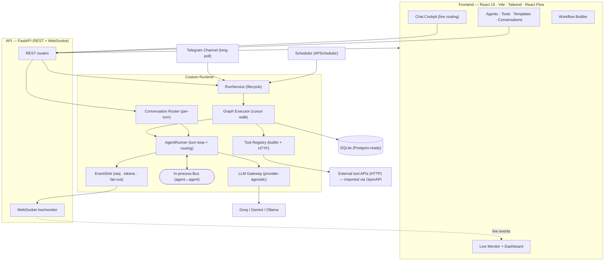

# Features & Architecture

A capability-oriented tour of the platform — **what each feature does, how to use it, and how it
works** — plus the **overall architecture**. For implementation detail see the [HLD](../HLD.md) and
the [LLD set](../lld/README.md); to *build* a workflow hands-on see [BUILD_A_WORKFLOW](../BUILD_A_WORKFLOW.md).

- [Overall architecture](#overall-architecture)
- [Feature catalog](#feature-catalog) — agents · tools · workflows & routing · templates · channels & chat · monitoring · dashboard · multi-tenant · scheduling
- [Deep-dives](#deep-dives)

---

## Overall architecture

The platform is one FastAPI backend + a React frontend over **three planes** — **Build**, **Runtime**,
**Observability** — glued by an in-process event bus and a single SQLite database. The LLM is served by
**Groq** (provider-agnostic gateway), and **Telegram** is the human channel.

- **Build plane** — design agents and a workflow graph in the UI, validate, save.
- **Runtime plane** — `RunService` starts a `Run`; the **Graph Executor** walks the graph node-by-node;
  each agent node runs an **`AgentRunner`** (prompt → LLM → tool loop → result); routing happens via the
  agent's **`handoff`** tool or edge **conditions**; agents consult peers via the **`send_message`** bus.
- **Observability plane** — every step emits a `RunEvent` (stamped with a per-run `seq`), persisted and
  fanned out over WebSocket so the Live Monitor renders in real time and **replays** finished runs from
  the same log.

**Two entry points into the runtime:** a **Run** (one-shot execution of a whole graph) and a **Chat**
(a conversation routed **per turn** through the workflow's supervisor — see [Channels & chat](#5-channels--live-chat)).

---

## Feature catalog

### 1. Agents & configuration
**What:** an agent is a configured persona with **9 dimensions** — name, role, system prompt,
provider, model, a **tool allow-list** ("skills"), channels, **memory** (window + optional rolling
summary), and **guardrails** (max steps/tokens/timeout). The *same* agent definition is reused for
workflow nodes **and** 1:1 channel chat.
**Use:** *Agents → New agent* — fill the dimensions; **Test** runs the *unsaved* config 1:1 so you can
iterate on a prompt before saving.
**How:** `AgentRunner.run()` composes the system prompt (role + memory summary + routing roster) and
runs a bounded reason→act→tool loop; guardrails end the turn cleanly with a stop-reason.
**Where:** `api/routers/agents.py` · `runtime/agent.py` · `components/AgentEditor.tsx`.

### 2. Tools (skills)
**What:** three kinds — **built-ins** (`web_fetch`, `calculator`, `send_telegram`), **no-code HTTP
tools** (define method · URL template with `{placeholders}` · params→JSON-Schema · headers ·
env-var-based auth), and **bulk import from an OpenAPI/Swagger spec** (one tool per operation).
**Use:** *Tools → New HTTP tool* (with a *Try it* tester), or *Tools → Import API* and paste a spec
URL (`…/openapi.json`) — a `…/docs` Swagger-UI URL is **auto-resolved** to the spec.
**How:** the tool executor routes args by location (path/query/body), never raises, and always times
out; secrets are referenced by **env-var name only**, never stored.
**Where:** `runtime/tools/` · `runtime/tools/openapi_import.py` · `api/routers/tools.py` · `components/ToolEditor.tsx`.

### 3. Workflows, the visual builder & routing
**What:** a graph of nodes (`start · agent · tool · router · end`) + edges with optional **conditions**,
supporting **feedback loops** (bounded by per-node `max_visits`). **Routing is composition-driven:**
wire one agent to **≥2** others and it becomes the **supervisor/router** — at runtime it's handed those
specialists **and their roles** plus a `handoff` tool, and returns the next agent + a reply.
**Use:** *Workflows → New* → drop agent nodes, connect them, click the supervisor to see its
**routes-to roster**; live validation shows a valid/invalid badge; **Save**, then **Run** or **Chat**.
**How:** the Graph Executor does a sequential single-cursor walk; routing precedence is
`handoff` → edge conditions → default edge; conditions are a safe AST evaluator (no `eval`).
**Where:** `pages/WorkflowBuilder.tsx` · `runtime/executor.py` · `runtime/conditions.py`.

### 4. Templates
**What:** reusable workflows (`is_template=true`). Ships with **3** — *Support Router* (supervisor
routing), *Collaborative Brief* (`send_message`), *Research → Report → Notify* (pipeline + loop).
**Use:** *Templates → Use* clones a runnable copy; create your own from *Workflows → Template* or the
Builder's *Template* button (**idempotent** per (tenant, name) — re-publishing updates, never
duplicates); delete from the Templates page.
**How:** a template and a workflow are the same entity; *Use* copies template→workflow,
*Save as template* copies workflow→template.
**Where:** `seed/templates.py` · `api/routers/workflows.py` (`/instantiate`, `/save-as-template`).

### 5. Channels & live chat
**What:** ≥1 agent reachable over **Telegram** (long-poll) for live human chat. A plain chat is **1:1**
with one agent; a **workflow-bound** chat routes **each turn** through the workflow's supervisor
(`{next-agent, reply}` + a sticky `curr_agent` for continuity). The **Chat Cockpit** is a split-screen
view: chat on the right while the graph animates the routing **live** on the left (travelling pulse on
the active edge, spotlight + camera-follow on the running agent, an activity ticker).
**Use:** message the Telegram bot, or *Workflows → Chat* / *Builder → Chat* in the UI.
**How:** the dispatcher resolves inbound → a persisted `Conversation` → a turn → a reply;
`conversation_router.py` runs the router (lean view) then the chosen specialist (full history).
**Where:** `channels/telegram.py` · `channels/dispatcher.py` · `runtime/conversation_router.py` · `pages/WorkflowChat.tsx`.

### 6. Live monitoring
**What:** real-time run observability — event timeline, **inter-agent messages**, and **token/cost**.
Replays finished runs from the same event log.
**Use:** open any run (the `?run=` drawer) for the timeline/agents/tokens tabs; the **Graph** view
replays the path on the canvas.
**How:** `EventSink` stamps a per-run `seq`, persists each `RunEvent`, derives totals from a single
source, and fans out over `/ws/monitor`; the client gap-fills via `GET /runs/{id}/events?after_seq=`.
**Where:** `runtime/events.py` · `ws/monitor.py` · `components/RunDrawer.tsx` · `pages/RunGraph.tsx`.

### 7. Dashboard analytics
**What:** a tenant-aware cockpit — live **total tokens · est. cost · avg run duration · conversations**,
plus charts (tokens/cost per run, runs-over-time, a completion-rate gauge) and the four headline
**impact metrics**.
**Use:** the **Dashboard** page; switch orgs via the sidebar to re-scope every number.
**How:** a pure, unit-tested helper reduces the tenant-scoped runs/conversations into the headline +
chart series (no fabricated numbers); recharts is lazy-loaded.
**Where:** `pages/Dashboard.tsx` · `lib/dashboardStats.ts` · `components/dashboard/`.

### 8. Multi-tenant SaaS
**What:** row-level isolation — each tenant owns its agents/tools/workflows/runs/conversations.
**Use:** the sidebar **tenant switcher** (sends `X-Tenant-Id`); a new tenant bootstraps with the
default built-in tools, and you build your own agents.
**How:** every router filters/sets `tenant_id`; runs inherit the workflow's tenant, conversations the
agent's.
**Where:** `models/tenant.py` · `core/tenancy.py` · `core/deps.py` · `components/TenantSwitcher.tsx`.

### 9. Scheduling
**What:** cron/interval triggers that start an agent or workflow run unattended (APScheduler).
**How/Where:** `runtime/scheduler.py` · `PUT /api/agents/{id}/schedule`. (Backend + API + 19 tests;
UI surfacing of the schedule field is a documented next-step.)

---

## Deep-dives
- **Hands-on build:** [BUILD_A_WORKFLOW.md](../BUILD_A_WORKFLOW.md) — create an SOP through the UI.
- **Architecture decisions + traceability:** [HLD.md](../HLD.md).
- **Per-module internals (01–11):** [lld/README.md](../lld/README.md).
