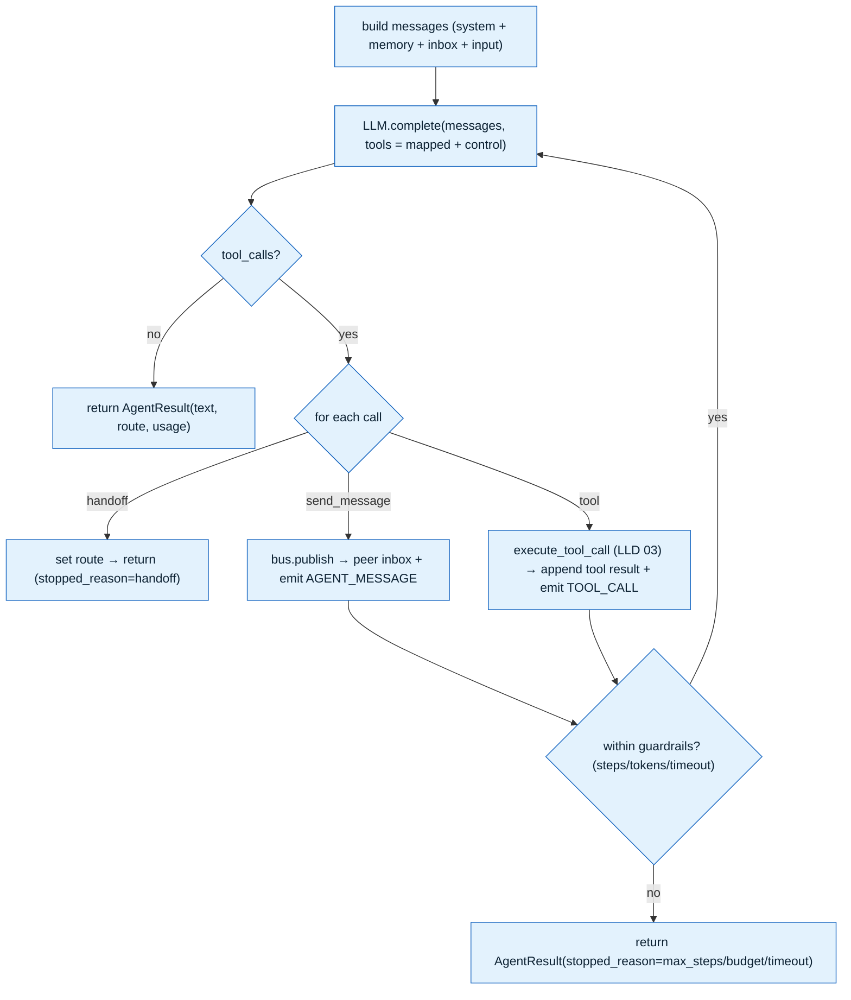

# LLD 05 — Agent

> The heart of the runtime: one agent's **turn**. Depends on [LLD 02](02-llm-gateway.md) (LLM), [LLD 03](03-tools.md) (tools), [LLD 04](04-message-bus.md) (peer messaging). Driven by the Executor ([LLD 06](06-executor.md)) and reused by Channels ([LLD 07](07-channels.md)). Status: **for review**.

## Responsibility
Given an agent's config + an input + context (history, peer inbox, allowed routes), run **one turn**: assemble the prompt → call the LLM → run the **tool-calling loop** → optionally **message peers** / **hand off** → return a structured `AgentResult`. The Agent is **pure-ish**: it calls the LLM/tools/bus and emits events, but it **does not touch the DB** — the Executor/Channel assemble history and persist results. This keeps the same `AgentRunner` usable in **two contexts** (below).

## Runs in two contexts (one class, reused)
1. **Workflow node** (Executor): input = upstream output / workflow input; `allowed_routes` = the node's out-edge agent targets; can hand off + message peers via the bus.
2. **Channel chat** (Telegram): input = the user's message; `allowed_routes = []` (no graph), no bus → behaves as a normal conversational assistant. Same code path.

> This reuse is deliberate: an agent is an agent whether it's a node in a multi-agent workflow or chatting 1:1 on Telegram.

## Files
```
backend/app/runtime/
  agent.py          # AgentRunner, AgentInput, AgentResult, prompt assembly, the turn loop
  agent_memory.py   # window + optional summarize_history()
  agent_spec.py     # in-memory AgentSpec (agent row + resolved tools) + control-tool specs
```

## Interfaces — `runtime/agent.py`
```python
from dataclasses import dataclass, field
from app.llm.types import Usage
from app.runtime.bus.base import BusMessage
from app.runtime.tools.base import ToolContext

@dataclass
class AgentSpec:                      # in-memory view the Executor/Channel builds from the DB
    name: str
    role: str
    system_prompt: str
    provider: str
    model: str
    tools: list                       # resolved Tool rows (the allow-list / "skills")
    guardrails: dict                  # {max_steps, max_tokens, max_tokens_total, timeout_s}
    memory_config: dict               # {type, window, summary}

@dataclass
class AgentInput:
    input: str                        # triggering content
    history: list[dict] = field(default_factory=list)   # prior msgs (OpenAI format), already windowed
    summary: str = ""                 # rolling summary memory (optional)
    inbox: list[BusMessage] = field(default_factory=list)   # peer messages (drained by Executor)
    allowed_routes: list[str] = field(default_factory=list) # peer agents this node may hand off to
    ctx: ToolContext = field(default_factory=ToolContext)

@dataclass
class AgentResult:
    text: str
    route: str | None = None          # chosen next agent (set iff handoff was called)
    structured: dict = field(default_factory=dict)   # optional fields for edge conditions
    usage: Usage = field(default_factory=Usage)      # accumulated across the whole turn
    steps: int = 0
    stopped_reason: str = "complete"  # complete | handoff | max_steps | budget | timeout | error
    tool_runs: list[dict] = field(default_factory=list)   # audit (name, ok, latency)
    peer_messages: list[BusMessage] = field(default_factory=list)
```

## Prompt assembly — `runtime/agent.py`
```python
def compose_system_prompt(spec: AgentSpec, allowed_routes: list[str], summary: str) -> str:
    parts = [spec.system_prompt.strip()]
    if spec.role:    parts.append(f"Your role: {spec.role}.")
    if summary:      parts.append(f"Conversation summary so far:\n{summary}")
    if allowed_routes:
        parts.append(
            "You are part of a multi-agent workflow. When another agent should handle the task, "
            f"call the `handoff` tool with one of: {', '.join(allowed_routes)}. "
            "Use `send_message` to share information with a peer while keeping control. "
            "Otherwise, answer directly.")
    return "\n\n".join(p for p in parts if p)

def build_messages(spec, inp: AgentInput) -> list[dict]:
    msgs = [{"role": "system", "content": compose_system_prompt(spec, inp.allowed_routes, inp.summary)}]
    msgs += inp.history                                   # windowed short-term memory
    if inp.inbox:                                         # peer messages → one framed user turn
        peers = "\n".join(f"[from {m.from_agent}] {m.content}" for m in inp.inbox)
        msgs.append({"role": "user", "content": f"Messages from other agents:\n{peers}"})
    if inp.input:
        msgs.append({"role": "user", "content": inp.input})
    return msgs
```

## The turn loop — `AgentRunner.run()`

```python
class AgentRunner:
    def __init__(self, spec: AgentSpec, *, bus=None, emit=lambda *a, **k: None):
        self.spec, self.bus, self.emit = spec, bus, emit
        self.tools_by_name = {t.name: t for t in spec.tools}

    async def run(self, inp: AgentInput) -> AgentResult:
        g = self.spec.guardrails
        msgs = build_messages(self.spec, inp)
        specs = build_tool_specs(self.spec) + control_tool_specs(inp.allowed_routes)  # LLD 03 + handoff/send_message
        usage, steps = Usage(), 0
        deadline = time.monotonic() + g.get("timeout_s", 60)
        try:
            while steps < g.get("max_steps", 6):
                steps += 1
                res = await llm.complete(
                    LLMRequest(messages=msgs, tools=specs or None, model=self.spec.model,
                               temperature=0.4, max_tokens=g.get("max_tokens", 1024)),
                    provider=self.spec.provider)
                usage += res.usage
                if not res.tool_calls:                                   # final answer
                    return AgentResult(text=res.text, usage=usage, steps=steps, stopped_reason="complete")
                msgs.append(_assistant_tool_turn(res))                   # echo assistant tool_calls
                for call in res.tool_calls:
                    if call.name == "handoff":
                        route = call.arguments.get("to_agent")
                        ok = route in inp.allowed_routes
                        msgs.append(_tool_msg(call.id, {"ok": ok, "routed_to": route if ok else None}))
                        if ok:
                            return AgentResult(text=res.text or f"Handing off to {route}.", route=route,
                                               usage=usage, steps=steps, stopped_reason="handoff")
                    elif call.name == "send_message" and self.bus:
                        bm = BusMessage(id=uuid4().hex, from_agent=self.spec.name,
                                        to_agent=call.arguments["to_agent"], content=call.arguments["content"],
                                        run_id=inp.ctx.run_id)
                        await self.bus.publish(bm); self.emit(EventType.AGENT_MESSAGE, _ev(bm))
                        msgs.append(_tool_msg(call.id, {"sent": True}))
                    else:
                        tool = self.tools_by_name.get(call.name)         # allow-list enforced here
                        result = (ToolResult(False, error=f"tool '{call.name}' not allowed")
                                  if not tool else await execute_tool_call(tool, call.arguments, inp.ctx))
                        self.emit(EventType.TOOL_CALL, {"tool": call.name, "ok": result.ok,
                                                        "latency_ms": result.latency_ms})
                        msgs.append(_tool_msg(call.id, result.output if result.ok else {"error": result.error}))
                if usage.total_tokens >= g.get("max_tokens_total", 8000):
                    return AgentResult(text=_last_text(msgs) or "(token budget reached)", usage=usage,
                                       steps=steps, stopped_reason="budget")
                if time.monotonic() > deadline:
                    return AgentResult(text="(turn timed out)", usage=usage, steps=steps, stopped_reason="timeout")
            return AgentResult(text=_last_text(msgs) or "(max steps reached)", usage=usage,
                               steps=steps, stopped_reason="max_steps")
        except Exception as e:
            self.emit(EventType.ERROR, {"agent": self.spec.name, "error": f"{type(e).__name__}: {e}"})
            return AgentResult(text="Sorry — I hit an error completing that.", usage=usage, steps=steps,
                               stopped_reason="error")
```

## Control tools — routing & async peer messaging — `runtime/agent_spec.py`
Injected **only** when the node has outgoing peer routes (`allowed_routes`):
```python
def control_tool_specs(allowed_routes: list[str]) -> list[dict]:
    if not allowed_routes: return []
    enum = {"type": "string", "enum": allowed_routes}
    return [
      _fn("handoff", "Delegate the task to another agent and end your turn.",
          {"to_agent": enum, "reason": {"type": "string"}}, required=["to_agent"]),
      _fn("send_message", "Send an async message to a peer agent; you keep control.",
          {"to_agent": enum, "content": {"type": "string"}}, required=["to_agent", "content"]),
    ]
```
- **`handoff`** = dynamic, LLM-decided routing (the Triage template's Billing/Tech choice; the Writer→Researcher feedback loop). It sets `AgentResult.route`, which the Executor follows (validated against the graph's out-edges).
- **`send_message`** = fire-and-forget peer message via the bus (LLD 04) — true async agent-to-agent, observable as an `AGENT_MESSAGE` event.
- This is the clean evolution of a parsed-JSON `{r, n}` routing token: **routing rides the providers' native tool-calling** instead of fragile JSON parsing — more robust and provider-agnostic. (Good live-session contrast point.)

## Memory — `runtime/agent_memory.py`
- **Short-term:** the caller passes `history` already windowed to `memory_config.window` (default 12 messages) by `conversation_id`.
- **Summary (optional):** when `memory_config.summary` is on and history exceeds the window, the caller invokes `summarize_history(llm, older_messages) -> str` (one cheap LLM call) and stores it on `Conversation.summary`; subsequent turns inject it via `compose_system_prompt`. Keeps long chats coherent without unbounded context.
```python
async def summarize_history(llm, messages: list[dict], prior: str = "") -> str:
    prompt = [{"role":"system","content":"Summarise the conversation in <=120 words, keeping facts, "
               "decisions, and open tasks."}, {"role":"user","content": prior + "\n" + _flatten(messages)}]
    res = await llm.complete(LLMRequest(messages=prompt, max_tokens=200, temperature=0.2))
    return res.text.strip()
```

## Guardrails / limits (from `agent.guardrails`)
| Key | Default | Effect |
|---|---|---|
| `max_steps` | 6 | max tool-loop iterations (prevents runaway loops) |
| `max_tokens` | 1024 | per-LLM-call output cap |
| `max_tokens_total` | 8000 | cumulative budget per turn → stop with best-so-far |
| `timeout_s` | 60 | wall-clock turn timeout |
Every stop path returns a valid `AgentResult` with a `stopped_reason` — **the turn never hangs or raises** to the Executor.

## How the Executor (LLD 06) & Channel (LLD 07) use it
```python
# Executor (workflow node):
runner = AgentRunner(spec, bus=bus, emit=run_emit)
result = await runner.run(AgentInput(input=upstream_output, history=run_history,
                                     inbox=bus.drain(spec.name), allowed_routes=out_edge_agents,
                                     ctx=ToolContext(run_id=run.id, conversation_id=str(run.id))))
persist_message(run.id, from_agent=spec.name, to_agent="...", content=result.text)   # LLD 01
run.total_tokens += result.usage.total_tokens; run.est_cost += result.usage.est_cost_usd
next_node = pick_next(node, result)                                                   # route or edge conditions (LLD 06)

# Channel (Telegram 1:1):
result = await AgentRunner(spec, emit=ws_emit).run(
    AgentInput(input=user_text, history=conv_history, summary=conv.summary,
               ctx=ToolContext(conversation_id=str(conv.id), chat_id=conv.external_id)))
await telegram.send(conv.external_id, result.text)
```

## Tests (`backend/tests/test_agent.py`)
- **Final answer** (mock LLM returns text, no tools) → `AgentResult.text`, `stopped_reason="complete"`.
- **Tool loop** (LLM returns a tool call, then text) → tool executed, result fed back, final text; `TOOL_CALL` emitted.
- **Handoff** → `route` set + validated against `allowed_routes`; bad target rejected.
- **send_message** → `bus.publish` called + `AGENT_MESSAGE` emitted.
- **Guardrails**: looping LLM hits `max_steps`/`max_tokens_total` → returns gracefully with the right `stopped_reason`.
- **Allow-list**: a tool call outside the agent's tools → "not allowed" result, no execution.
- This is the core of the **critical-path "workflow execution"** test (full graph in LLD 06).

## Decisions / tradeoffs
- **Routing via native tool-calling (`handoff`), not a parsed JSON token** — robust across providers, no brittle string parsing; a clean upgrade over a parsed-JSON `{r,n}` routing token (which you can cite as prior art + its weakness).
- **Agent is DB-free and context-agnostic** — given input+context it returns a result; the Executor/Channel own history + persistence. This is why the *same* runner serves both workflows and channel chats.
- **Control tools injected only in multi-agent context** — a 1:1 channel agent isn't told about handoff/peers, so it just answers (no confusing affordances).
- **Every stop path returns a valid result** (`stopped_reason`), never hangs/raises — essential for an autonomous loop and for clean monitoring.
- **Memory is windowed + optional-summary**, not a vector store — right-sized for the prototype; vector/long-term memory is a documented prod next-step.
- **`emit` is injected** (callback) so the Agent stays decoupled from the WebSocket/DB; the Executor wires it to the event stream.

---
*Next: [LLD 06 — Graph Executor](06-executor.md) — the run lifecycle that drives agents over the workflow graph (nodes, edge conditions, loops, events, persistence). Reply "go" to continue, or flag changes.*
