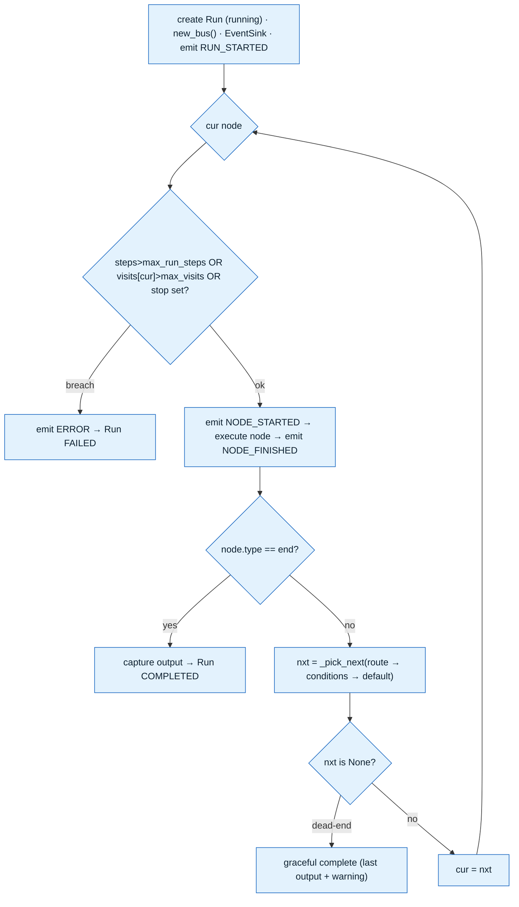

# LLD 06 — Graph Executor

> The run lifecycle that drives agents over the workflow graph. Depends on [LLD 01](01-data-model.md) (Run/Message/RunEvent/Conversation, graph JSON), [LLD 04](04-message-bus.md) (bus), [LLD 05](05-agent.md) (AgentRunner). Drives the live monitor (WebSocket, [LLD 09](09-api.md)). Status: **for review** — *hardened via a 7-agent parallel-design + 3-lens adversarial-review pass; the must-fixes below are folded in.*

## Responsibility
Given a `Workflow.graph` + an input, **drive a run**: create a `Run`, walk the directed (possibly cyclic) graph node-by-node, run an `AgentRunner` per agent node, decide the next node from the agent's **handoff route** *or* **edge conditions** (feedback loops included), **persist** Run/Message/RunEvent, **aggregate** token/cost, and **stream** every event to the live monitor. It is the **only** component that touches the DB during a run (the Agent is DB-free, LLD 05).

## Execution model — **sequential single-cursor walk (v1)**
A **single cursor** moves through the graph one node at a time; `_pick_next` advances it. This is a deliberate v1 choice (the adversarial review found that a concurrent scheduler introduced shared-`Session` races, JOIN re-arm deadlocks on loops, and non-deterministic event ordering — none of which a prototype needs).

**Why this is the right call (and how I'd scale it):** sequential gives **deterministic, provably-terminating** runs, trivial event ordering, and no concurrency bugs — ideal for a clean demo + live-defence. The documented **#1 production next-step** is parallel branches: replace the cursor with a ready-set under `asyncio.TaskGroup`, give each task its own short-lived `Session`, and add barrier JOINs + a real broker bus. The interfaces below (`_pick_next`, per-node `EventSink.emit`, short-lived sessions) are already shaped so that swap is localized.

> Both shipped templates (linear+feedback, and triage+escalation) are fully expressible sequentially, so v1 loses no functionality.

## Files
```
backend/app/runtime/
  executor.py     # GraphExecutor, Graph/Node/Edge, RunState, the run loop, _pick_next
  conditions.py   # eval_condition() — the one safe AST evaluator
  events.py       # EventSink, EventEnvelope, RunEvent taxonomy, persist helpers
  run_service.py  # RunService.start_run / cancel_run (background task + stop registry)
```

## Graph value objects — `executor.py`
```python
@dataclass(frozen=True)
class Node:
    id: str
    type: str                 # "start" | "agent" | "tool" | "router" | "end"
    ref: int | None = None    # agent_id (agent) / tool_id (tool)
    config: dict = field(default_factory=dict)   # {"max_visits": int, "output_key": str, ...}

@dataclass(frozen=True)
class Edge:
    src: str; dst: str
    condition: str | None = None   # safe expr (conditions.py); None/""/"else" = default edge

@dataclass
class Graph:
    nodes: dict[str, Node]
    out_edges: dict[str, list[Edge]]   # insertion order preserved (condition precedence)
    start_id: str
    agent_name_of: dict[str, str]      # node_id -> agent name (for route matching + bus)
    @classmethod
    def parse(cls, g: dict) -> "Graph": ...

@dataclass
class RunState:
    run_id: int
    input: dict
    last: "NodeOutcome | None" = None
    outcomes: dict[str, "NodeOutcome"] = field(default_factory=dict)
    visits: dict[str, int] = field(default_factory=dict)    # node_id -> times executed (loop cap)
    steps: int = 0
    total_tokens: int = 0
    est_cost: float = 0.0
    output: dict | None = None

@dataclass
class NodeOutcome:
    node_id: str; text: str = ""; structured: dict = field(default_factory=dict)
    route: str | None = None; agent_name: str | None = None
    usage_tokens: int = 0; cost: float = 0.0; stopped_reason: str = "complete"
```

## Graph validation (called on workflow save → API 400, and at run start)
Realises the LLD 01 "validate-on-save" note. Rejects bad graphs **before** a Run row exists:
```python
def validate_graph(self, gj: dict, db) -> Graph:
    errs = []; nodes = gj["nodes"]; edges = gj["edges"]; ids = [n["id"] for n in nodes]
    if len(ids) != len(set(ids)): errs.append("duplicate node ids")
    starts = [n for n in nodes if n["type"]=="start"]; ends = [n for n in nodes if n["type"]=="end"]
    if len(starts) != 1: errs.append(f"need exactly 1 start, got {len(starts)}")
    if not ends:         errs.append("need >= 1 end")
    idset = set(ids)
    for e in edges:
        if e["from"] not in idset or e["to"] not in idset: errs.append(f"edge {e['from']}->{e['to']} unknown node")
    for n in nodes:                                   # refs must resolve to live rows
        if n["type"]=="agent" and not db.get(Agent, n.get("ref")): errs.append(f"{n['id']}: agent ref missing")
        if n["type"]=="tool"  and not db.get(Tool,  n.get("ref")): errs.append(f"{n['id']}: tool ref missing")
    if len(starts)==1:                                # reachability + end reachable (BFS)
        adj = {}; [adj.setdefault(e["from"],[]).append(e["to"]) for e in edges]
        seen, q = set(), [starts[0]["id"]]
        while q:
            x = q.pop();  seen.add(x);  q += [d for d in adj.get(x,[]) if d not in seen]
        if idset-seen: errs.append(f"unreachable nodes: {sorted(idset-seen)}")
        if not (seen & {n['id'] for n in ends}): errs.append("no end reachable from start")
    for n in nodes:                                   # branching node MUST have a default edge (no dead-ends)
        if n["type"] in ("agent","router"):
            oe = [e for e in edges if e["from"]==n["id"]]
            if oe and not any(e.get("condition") in (None,"","else") for e in oe):
                errs.append(f"{n['id']}: all out-edges conditional — add a default ('else') edge")
    if errs: raise GraphValidationError(errs)         # API maps to 400
    return Graph.parse(gj)
```

## The run loop (sequential, every-path-bounded) — `GraphExecutor`

```python
async def _run_loop(self, run, graph, bus, st, session_factory):
    cur = graph.start_id
    while True:
        st.steps += 1
        if st.steps > self.max_run_steps:                       # GLOBAL cap (every iteration)
            self.emit(EventType.ERROR, {"scope":"run","error":"max_run_steps exceeded"})
            raise ExecutorAbort("max_run_steps")                # → Run FAILED (not success)
        if self.stop.is_set():                                  # cooperative cancel (between nodes)
            raise asyncio.CancelledError()
        node = graph.nodes[cur]
        st.visits[cur] = st.visits.get(cur, 0) + 1
        max_visits = node.config.get("max_visits", self.default_max_visits)   # PER-NODE cap (loop guard)
        if st.visits[cur] > max_visits:
            self.emit(EventType.ERROR, {"scope":"node","node_id":cur,"error":"max_visits exceeded"})
            raise ExecutorAbort(f"max_visits at {cur}")         # → Run FAILED (bounded feedback)

        t0 = time.perf_counter()
        self.emit(EventType.NODE_STARTED, {"node_id":cur,"node_type":node.type,"visit":st.visits[cur],"step":st.steps})
        outcome = await self._execute_node(node, graph, bus, st, session_factory)
        st.last, st.outcomes[cur] = outcome, outcome
        st.total_tokens += outcome.usage_tokens; st.est_cost += outcome.cost
        self.emit(EventType.NODE_FINISHED, {"node_id":cur,"node_type":node.type,"agent_name":outcome.agent_name,
                  "stopped_reason":outcome.stopped_reason,"route":outcome.route,"tokens":outcome.usage_tokens,
                  "est_cost_usd":round(outcome.cost,6),"duration_ms":int((time.perf_counter()-t0)*1000),
                  "text_preview":outcome.text[:200]})

        if node.type == "end":
            st.output = {"text": outcome.text, **outcome.structured}; return
        nxt = self._pick_next(node, graph, st, outcome)
        if nxt is None:                                         # DEAD-END policy → graceful completion
            self.emit(EventType.NODE_FINISHED, {"node_id":cur,"note":"dead_end_terminal"})
            st.output = {"text": outcome.text, **outcome.structured}; return
        cur = nxt
```
`_execute_node` dispatches by type: **start** injects `st.input`; **agent** builds/【caches】an `AgentRunner`, **drains the bus** for peer messages, runs the turn, persists a `Message`, returns a `NodeOutcome`; **tool** runs a tool directly (rare — tools usually live inside agents); **router** is an agent-less decision node (no LLM, routing only); **end** captures output.

> **Agent `stopped_reason` ∈ {max_steps,budget,timeout} is NOT a run failure** — the node produced a (partial) answer; the run continues and the reason is recorded in `NODE_FINISHED`. Only a missing ref, an infra error, or a cap breach fails the run.

## Routing — handoff route → conditions → default — `_pick_next`
```python
def _pick_next(self, node, graph, st, outcome) -> str | None:
    edges = graph.out_edges.get(node.id, [])
    # (1) explicit LLM handoff (LLD 05) wins IF it names a real out-edge target agent
    if outcome and outcome.route:
        for e in edges:
            if graph.agent_name_of.get(e.dst) == outcome.route:
                return e.dst
        self.emit(EventType.ERROR, {"scope":"node","node_id":node.id,
                  "error":f"handoff '{outcome.route}' is not an out-edge; falling back to conditions"})
    # (2) edge conditions in declared order; first True wins; remember the default ('else') edge
    ctx = EvalContext(last=_ctx_last(outcome), input=st.input, attempts=st.visits.get(node.id, 0))
    default = None
    for e in edges:
        if e.condition in (None, "", "else"):
            default = default or e; continue
        if eval_condition(e.condition, ctx):
            return e.dst
    return default.dst if default else None      # None → dead-end → graceful completion
```
`_ctx_last = {"text", "route", "stopped_reason", **outcome.structured}`. Precedence is explicit and deterministic; `attempts` = current node's visit count (so the documented `attempts < 3` loop-guard works).

## The one safe condition evaluator — `conditions.py`
A single AST-whitelist evaluator (the review found two contradictory ones — this replaces both). **No `eval`/`exec`, no calls, no dunder/attribute escapes.** Supports the documented examples (`last.intent == "billing"`, `attempts < 3`, `input.foo in [...]`, `and/or/not`).
```python
import ast
_ALLOWED = (ast.Expression, ast.BoolOp, ast.And, ast.Or, ast.UnaryOp, ast.Not,
            ast.Compare, ast.Name, ast.Load, ast.Constant, ast.Attribute,
            ast.Subscript, ast.List, ast.Tuple, ast.Index,
            ast.Eq, ast.NotEq, ast.Lt, ast.LtE, ast.Gt, ast.GtE, ast.In, ast.NotIn)
_ROOTS = {"last", "input", "attempts"}

def eval_condition(expr: str | None, ctx) -> bool:
    if expr in (None, "", "else"): return True
    try:
        tree = ast.parse(expr, mode="eval")
        for n in ast.walk(tree):
            if not isinstance(n, _ALLOWED):                 raise ValueError(type(n).__name__)
            if isinstance(n, ast.Name) and n.id not in _ROOTS:  raise ValueError(f"name {n.id}")
            if isinstance(n, ast.Attribute) and n.attr.startswith("_"): raise ValueError("dunder")
        return bool(_ev(tree.body, ctx))                    # _ev: Name→ctx field, Attribute/Subscript→dict.get
    except Exception:
        return False                                        # routing must never crash; default edge handles it
```
`last`/`input` resolve to dicts (so `last.intent` ≡ `last["intent"]`, missing key → `None`); `attempts` is an int. Any malformed/illegal expression → `False`, and the **default edge** carries the run forward.

## Termination guarantees (enforced on EVERY path)
| Guard | Default | Breach → |
|---|---|---|
| **Global** `max_run_steps` (total node executions) | 50 | `ERROR` + Run **FAILED** |
| **Per-node** `max_visits` (`node.config`, loop/feedback cap) | 8 | `ERROR` + Run **FAILED** |
| **Run** wall-clock `run_timeout_s` (`asyncio.wait_for`) | 300 | `ERROR` + Run **FAILED** |
| (Agent turn already capped: `max_steps`/`max_tokens_total`/`timeout_s`, LLD 05) | — | node finishes partial (run continues) |
A cap breach is always a **failure**, never a silently-"completed" run. The loop is therefore guaranteed to terminate.

## Events & persistence — `events.py`
**`EventSink`** (one per run) is the observability spine. `emit(type, payload)` is synchronous: stamp a per-run monotonic **`seq`** → persist a `RunEvent` (best-effort; never breaks the run) → aggregate token/cost (from `TOKEN_USAGE`) → fan-out a copy to the WebSocket `MonitorHub` (non-blocking). The executor injects `sink.emit` as the Agent's `emit` (LLD 05), wrapping it per-node to stamp `node_id`.

**RunEvent taxonomy** (payloads; `seq` added to every one):
| Type | Payload |
|---|---|
| `run_started` | `{workflow_id, trigger, input_preview, node_count}` |
| `node_started` | `{node_id, node_type, agent_name?, visit, step}` |
| `node_finished` | `{node_id, node_type, agent_name?, stopped_reason, route?, tokens, est_cost_usd, duration_ms, text_preview}` |
| `agent_message` | `{msg_id, from_agent, to_agent, content_preview, broadcast}` *(emitted in AgentRunner)* |
| `tool_call` | `{node_id, agent_name, tool, ok, latency_ms, error?}` *(emitted in AgentRunner)* |
| `token_usage` | `{node_id, agent_name, model, provider, prompt_tokens, completion_tokens, total_tokens, est_cost_usd, run_total_tokens, run_est_cost}` |
| `error` | `{scope:"node"|"run"|"tool", node_id?, agent_name?, error, stopped_reason?}` |
| `run_finished` | `{status, total_tokens, est_cost, duration_ms, output_preview, error?}` |

**Persistence**: short-lived `Session` per op via `session_factory` (no shared Session — the review's race fix, also concurrency-ready). Node outputs + inter-agent messages → `Message` rows (`channel="internal"`); token/cost aggregated onto `Run` (`run.total_tokens += usage.total_tokens`, `run.est_cost += usage.est_cost_usd`). Live history is the same data the monitor streams.

## Bus integration (no blocking → no deadlock)
Agents **never** `await bus.receive()` in v1. Before an agent node runs, the executor calls `bus.drain(agent_name)` and folds peer messages into `AgentInput.inbox` (LLD 05). `send_message` tool-calls publish to a peer's inbox, delivered when that peer next executes. Edge traversal passes the producing node's output as the successor's `input`. All inter-agent traffic is persisted (`Message`) + emitted (`AGENT_MESSAGE`).

## RunService — `run_service.py`
```python
class RunService:
    async def start_run(self, workflow_id, run_input, trigger=TriggerType.MANUAL) -> int:
        # validate_graph (→400 if bad, NO Run row) → create Run(running) → launch
        # GraphExecutor.run as a background asyncio.Task; register run.id → stop Event for cancel.
        ...
    async def cancel_run(self, run_id) -> bool:
        # set the run's stop Event (checked between nodes); in-flight node finishes (own timeout).
        ...
```

## Concrete template traces
**T1 — Research → Report → Notify (linear + feedback):**
`start`(inject topic) → `researcher`(web_fetch) → `writer`(summarise). Writer either routes via condition `last.needs_more == true` **back to** `researcher` (`max_visits:3` guards the loop) or falls through (default edge) to `notifier`(send_telegram) → `end`. Events stream live; tokens accrue on the Run.

**T2 — Support Triage (handoff + escalation loop):**
`start` → `triage`(agent) calls `handoff("billing")` or `handoff("tech")` → that specialist resolves; if `last.resolved == false`, a conditional edge routes to `escalation`(agent); escalation can loop back to `triage` (capped) or reach `end`. Demonstrates LLM-driven routing **and** condition-driven feedback in one graph.

## Failure handling (summary)
- Bad graph → `GraphValidationError` → API **400**, no Run created.
- Missing/vanished agent ref at runtime → `ERROR(run)` → Run **FAILED** (graceful, no hang).
- Cap breach (steps/visits/timeout) → `ERROR` → Run **FAILED**.
- Agent turn limit (LLD 05) → node finishes partial → run **continues**.
- Tool failure (LLD 03) → tool message back to the LLM → agent recovers.
- `EventSink`/persist failure → swallowed (monitoring never breaks a run).

## Tests (`backend/tests/test_executor.py`) — the critical "workflow execution" path
- linear 2-agent run → `COMPLETED`, output + token totals correct, ordered events.
- **feedback loop** terminates at `max_visits` (and a healthy loop exits via the default edge).
- **handoff routing** picks the right successor; invalid handoff falls back to conditions.
- `eval_condition`: `attempts < 3` true/false; `last.intent == "billing"`; rejects `__import__`/calls → `False`.
- caps: forced runaway → `FAILED` with the right `error` (never "completed").
- dead-end node → graceful completion (no hang).
- `validate_graph`: missing ref / no-default-edge / unreachable / multi-start → 400.
- cancel between nodes → `FAILED(error="cancelled")`.

## Decisions / tradeoffs
- **Sequential single-cursor walk for v1** — deterministic, provably-terminating, race-free, trivially-ordered events; both templates fit. *Parallel branches are the documented #1 prod next-step* (ready-set + `TaskGroup` + per-task sessions + barrier JOINs + broker bus) — and the cleanest "how would you scale this?" answer.
- **Caps on every path, breach = FAILED** — bounded loops are a hard requirement; a runaway is an error, not a success.
- **One safe AST condition evaluator** — supports the documented mini-language with zero code-execution risk; failure defaults to the mandatory default edge.
- **Handoff-route precedence over conditions** — LLM-driven routing is intentional; conditions are the deterministic fallback + the loop/branch mechanism.
- **Short-lived sessions + injected `emit`** — no shared-Session race, executor owns all persistence, Agent stays pure (LLD 05). Keeps the concurrency upgrade localized.
- **Dead-end = graceful completion** (validate_graph already requires default edges, so it's rare) — never hang.

---
*Hardened by a multi-agent design + adversarial-review pass (concurrency / termination / consistency lenses); 17 must-fix issues folded in. Next: [LLD 07 — Channels](07-channels.md). Reply "go" to continue, or flag changes.*
